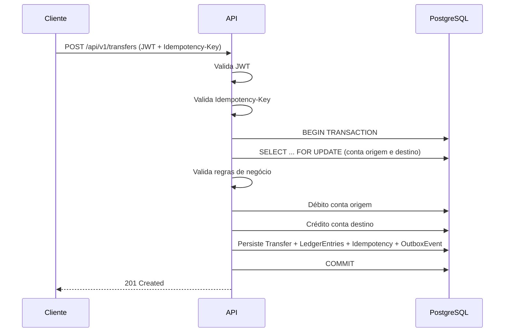

<div align="center">

# 🏛️ Core Banking API
### Plataforma de Transferências Bancárias | Consistência Transacional & Ledger Contábil

[](https://www.oracle.com/java/)
[](https://spring.io/projects/spring-boot)
[](https://www.postgresql.org/)
[](https://jwt.io/)
[](#-status-do-projeto)
[](#-licença)

**API de transferências bancárias com Spring Boot e PostgreSQL, projetada para garantir consistência transacional, rastreabilidade financeira e processamento seguro de operações monetárias.**

[Objetivo](#-objetivo) •
[Arquitetura](#%EF%B8%8F-arquitetura-da-solução) •
[Garantias ACID](#-garantias-arquiteturais) •
[Componentes](#-componentes) •
[Endpoint](#-endpoint-principal) •
[Roadmap](#-evolução-planejada)

</div>

---

## 🌐 Demonstração

🔗 **[benjaminreiis.github.io/core-banking-system](https://benjaminreiis.github.io/core-banking-system/#endpoints)**

---

## 🧠 Sobre o Projeto

A **Core Banking API** é uma API de transferências bancárias desenvolvida com **Spring Boot** e **PostgreSQL**, projetada para garantir **consistência transacional**, **rastreabilidade financeira** e **processamento seguro** de operações monetárias.

A solução adota práticas utilizadas em sistemas financeiros reais, incluindo:

- ⚛️ **ACID Transactions**
- 🔒 **Pessimistic Locking**
- 📒 **Double-Entry Ledger**
- 🔁 **Idempotência**
- 📤 **Outbox Pattern**

---

## 🎯 Objetivo

Implementar uma plataforma de transferências entre contas que garanta:

- ✅ Consistência dos saldos
- ✅ Integridade das operações financeiras
- ✅ Proteção contra processamento duplicado
- ✅ Segurança em cenários concorrentes
- ✅ Auditabilidade completa das movimentações
- ✅ Preparação para integração orientada a eventos

---

## 🏗️ Arquitetura da Solução

Cada transferência é executada dentro de **uma única transação de banco de dados**, assegurando que todas as alterações sejam persistidas de forma atômica.

### Fluxo Transacional

```text
POST /api/v1/transfers
        │
        ▼
Validação do JWT
        │
        ▼
Validação da Idempotency-Key
        │
        ▼
Início da Transação
        │
        ▼
Lock das Contas (SELECT FOR UPDATE)
        │
        ▼
Validações de Negócio
        │
        ├─ Saldo disponível
        ├─ Moeda compatível
        ├─ Conta ativa
        └─ Ownership
        │
        ▼
Débito da Conta Origem
        │
        ▼
Crédito da Conta Destino
        │
        ▼
Persistência
        │
        ├─ Transfer
        ├─ Ledger Entries
        ├─ Idempotency Record
        └─ Outbox Event
        │
        ▼
Commit
        │
        ▼
HTTP 201 Created
```



---

## 🛡️ Garantias Arquiteturais

| Propriedade ACID | Como é garantida |
|---|---|
| **Atomicidade** | Uma transferência é concluída integralmente ou revertida completamente em caso de falha |
| **Consistência** | As regras de negócio são validadas antes da persistência dos dados, impedindo estados inválidos |
| **Isolamento** | O uso de bloqueio pessimista evita alterações concorrentes sobre os mesmos registros |
| **Durabilidade** | Após o commit da transação, os dados permanecem persistidos e recuperáveis |

Além das garantias ACID, o sistema implementa:

| Propriedade | Descrição |
|---|---|
| **Idempotência** | Requisições repetidas com a mesma chave de idempotência retornam o mesmo resultado, sem reprocessamento |
| **Auditabilidade** | Todas as movimentações financeiras são registradas em ledger para rastreabilidade completa |

---

## 📂 Estrutura do Projeto

```text
src/main/java/com/example/corebanking
│
├── CoreBankingApplication.java
│
├── domain
│   ├── Account.java
│   ├── LedgerEntry.java
│   ├── OutboxEvent.java
│   └── EntryType.java
│
├── repository
│   ├── AccountRepository.java
│   └── LedgerEntryRepository.java
│
├── exception
│   ├── BusinessException.java
│   └── InsufficientFundsException.java
│
└── job
    └── OutboxPublisherJob.java
```

---

## 🧩 Componentes

### `Account`

Representa uma conta bancária dentro do domínio.

**Responsabilidades:**
- Armazenar saldo disponível
- Identificar o proprietário da conta
- Controlar status operacional
- Executar operações de débito e crédito

**Principais atributos:**

```java
UUID id;
UUID ownerId;
String currency;
BigDecimal balance;
AccountStatus status;
```

---

### `AccountRepository`

Responsável pelo acesso e persistência das contas. Também fornece mecanismos de bloqueio para garantir consistência durante transferências concorrentes.

**Exemplo de bloqueio pessimista:**

```java
@Lock(LockModeType.PESSIMISTIC_WRITE)
Optional<Account> findById(UUID id);
```

---

### `BusinessException`

Exceção base para violações de regras de negócio.

**Exemplos:**
- Conta inexistente
- Conta bloqueada
- Moeda incompatível
- Operação não autorizada

---

### `InsufficientFundsException`

Exceção especializada para cenários em que o saldo disponível é insuficiente para concluir a transferência.

---

### `EntryType`

Enumeração utilizada para classificação de lançamentos contábeis.

```java
public enum EntryType {
    DEBIT,
    CREDIT
}
```

---

### `LedgerEntry`

Representa um lançamento financeiro registrado no ledger.

Cada transferência gera **obrigatoriamente dois registros**:
- Débito da conta de origem
- Crédito da conta de destino

Essa abordagem garante rastreabilidade e conformidade contábil.

---

### `LedgerEntryRepository`

Responsável pela persistência e consulta dos registros financeiros. Permite auditoria completa das movimentações realizadas no sistema.

---

### `OutboxEvent`

Representa um evento de domínio armazenado para publicação assíncrona. Os eventos são persistidos **na mesma transação** da transferência, garantindo consistência entre o estado do banco e os eventos produzidos.

**Exemplo:**

```json
{
  "eventType": "TRANSFER_COMPLETED",
  "aggregateId": "uuid",
  "published": false
}
```

---

### `OutboxPublisherJob`

Processo responsável pela leitura e publicação dos eventos pendentes da tabela de outbox.

**Fluxo:**

```text
Buscar eventos pendentes
        │
        ▼
Publicar evento
        │
        ▼
Atualizar status para publicado
```

---

## 🔒 Controle de Concorrência

Para evitar inconsistências decorrentes de múltiplas transações simultâneas, as contas participantes da transferência são bloqueadas durante o processamento.

```sql
SELECT *
FROM accounts
WHERE id IN (?, ?)
FOR UPDATE;
```

Esse mecanismo impede condições de corrida e elimina cenários de **double spending**.

---

## 📒 Modelo Contábil (Double-Entry Ledger)

Toda transferência gera dois lançamentos financeiros complementares.

**Exemplo:**

```text
Transferência: R$ 100,00

Conta Origem
    DEBIT  -100,00

Conta Destino
    CREDIT +100,00
```

**Regra fundamental:**

```text
Σ Débitos + Σ Créditos = 0
```

Essa abordagem assegura integridade contábil e auditabilidade.

---

## 📡 Endpoint Principal

### Criar Transferência

```http
POST /api/v1/transfers
Authorization: Bearer <jwt>
Idempotency-Key: 550e8400-e29b-41d4-a716-446655440000
Content-Type: application/json
```

**Payload**

```json
{
  "sourceAccountId": "e7f3a6d2-8f84-4dc9-a02f-8d5e5b21b58f",
  "destinationAccountId": "3f31cb13-45f4-4bfc-a71d-9c1b0e4f37f5",
  "amount": 100.00,
  "currency": "BRL"
}
```

**Response**

```json
{
  "transferId": "8f17d7d9-76cc-48b5-8a79-8fd0f90f40d3",
  "status": "COMPLETED"
}
```

---

## 📋 Regras de Negócio

- O valor da transferência deve ser maior que zero
- A conta de origem deve estar ativa
- A conta de destino deve estar ativa
- Ambas as contas devem operar na mesma moeda
- O saldo disponível deve ser suficiente para a operação
- Não é permitido transferir para a própria conta
- O usuário autenticado deve possuir autorização sobre a conta de origem

---

## 📊 Status do Projeto

> ✅ **Fase 1 concluída** — fundação transacional implementada (domínio, repositórios, locking, ledger e outbox).
> 🚧 Fases 2 a 4 em planejamento — veja [Evolução Planejada](#-evolução-planejada).

---

## 🗺️ Evolução Planejada

### Fase 2
- [ ] `Transfer` Entity
- [ ] `TransferRepository`
- [ ] `TransferService`
- [ ] `TransferController`
- [ ] JWT Authentication
- [ ] Idempotency Middleware

### Fase 3
- [ ] Integração com Kafka
- [ ] Dead Letter Queue (DLQ)
- [ ] Retry Policies
- [ ] Observabilidade e métricas
- [ ] Distributed Tracing

### Fase 4
- [ ] Testes de carga
- [ ] Testes de concorrência
- [ ] Deploy em Kubernetes
- [ ] Pipeline CI/CD
- [ ] Estratégias avançadas de resiliência

---

## 🧭 Princípios Adotados

- Domain-Driven Design (DDD)
- Clean Architecture
- SOLID
- Event-Driven Architecture
- Transactional Consistency
- Auditability by Design
- Scalability
- Fault Tolerance

---

## ✅ Resultado da Fase 1

Ao final desta fase, o sistema possui uma **fundação transacional sólida** para operações financeiras, garantindo integridade dos saldos, rastreabilidade completa das movimentações e segurança em cenários concorrentes — servindo como base para futuras integrações orientadas a eventos e escalabilidade horizontal.

---

## 👨‍💻 Autor

**Benjamin Reis**

[](https://github.com/benjaminreiis)

---

## 📄 Licença

Este projeto está sob a licença MIT. Veja o arquivo [LICENSE](LICENSE) para mais detalhes.

---

<div align="center">

⭐ Se este projeto foi útil, considere deixar uma estrela no repositório!

</div>
